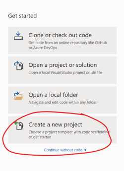
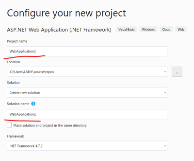

# Get Started With ASP.NET MVC in Visual Studio 2019

## 1. Create Project

1. When you start Visual Studio Click on *Create a new project* in the dialog box.

1. Select template: **ASP.NET Web Application (.NET Framework)** and click *Next*

1. Enter a name for your project in the *Configure your new project* dialog box and optionally change the solution name and click *Create* 

1. In the *Create a new ASP.NET Web Application* dialog select **MVC** and make sure the *MVC* checkbox is marked
1. Also check the *Also create a project for unit tests*
1. Click *Create*

## 2. The Solution

A solution is created and shown in **Solution Explorer**  
The project is created with a default implementation you can check it out by running the project.

